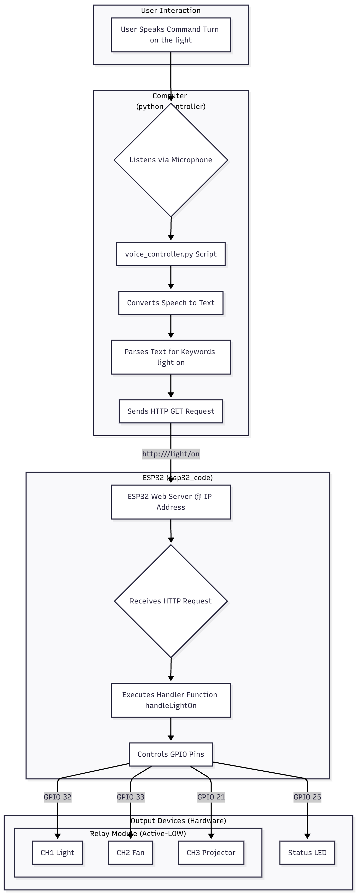

# Voice-Controlled Lab

Voice-controlled ESP32 lab automation.

Listens for voice commands via microphone and sends HTTP requests to an ESP32 web server to control connected devices (lights, fans, etc).

## Repository

GitHub: https://github.com/DakshThakur-13/Voice-Controlled-Lab

## Features

-  **Voice Control**: Natural language commands for device control
-  **ESP32 Integration**: Web-based device control via HTTP
-  **Bulk Operations**: Control all devices with a single command
-  **Logging & Monitoring**: Comprehensive logging and health checks
-  **Tested**: Unit tests with pytest
-  **Configurable**: CLI arguments and environment variables

##  Quick Start

### Prerequisites

- Python 3.9 or higher
- ESP32 development board
- Arduino IDE or PlatformIO
- Microphone (for voice recognition)

### Python Setup

1. Clone the repository:
```bash
git clone https://github.com/YOUR_USERNAME/Voice_Controlled_Lab.git
cd Voice_Controlled_Lab
```

2. Install dependencies:
```bash
pip install -r requirements.txt
```

3. Run the voice controller:
```bash
python voice_controller.py --ip YOUR_ESP32_IP
```

### ESP32 Setup

1. Open `lab_controller_esp32/lab_controller_esp32.ino` in Arduino IDE
2. Create `lab_controller_esp32/secrets.h` with your Wi-Fi credentials:
```cpp
const char* ssid = "Your_SSID";
const char* password = "Your_Password";
```
3. Upload to your ESP32
4. Note the IP address from Serial Monitor

##  Usage

### Voice Commands

| Command | Action |
|---------|--------|
| "LED on/off" | Control LED |
| "Light on/off" | Control light |
| "Projector on/off" | Control projector |
| "Fan on/off" | Control fan |
| "Turn everything on/off" | Control all devices |

### Command Line Options

```bash
python voice_controller.py --help
```

Options:
- `--ip`: ESP32 IP address (default: 192.168.0.172)
- `--ambient`: Ambient noise adjustment duration in seconds
- `--verbose`: Enable debug logging

##  Development

### Running Tests

```bash
pytest -v
```

### Code Style

```bash
flake8 voice_controller.py
```

##  Architecture



### System flow (Mermaid)

```mermaid
flowchart TB
	%% User speaks a command
	U[User Interaction\nUser says: "Turn on the light"]

	%% Computer side
	subgraph PC[Computer (Python controller)]
		M{Listens via Microphone}
		V[voice_controller.py]
		STT[Converts Speech to Text\n(Google API)]
		PARSE[Parses Text for\nkeywords: "light on"]
		HTTP[Send HTTP GET\nhttp://ESP32_IP/light/on]
	end

	%% ESP32 side
	subgraph MCU[ESP32 (esp32_code)]
		S[ESP32 Web Server @ IP Address]
		R{Receives HTTP Request}
		H[Executes handler function\nhandleLightOn]
		GPIO[Controls GPIO Pins]
	end

	%% Hardware outputs
	subgraph OUT[Output Devices (Hardware)]
		RELAY[Relay Module (Active-LOW)]
		CH1[CH1 Light  \nGPIO32]
		CH2[CH2 Fan    \nGPIO33]
		CH3[CH3 Projector \nGPIO21]
		LED[Status LED \nGPIO25]
	end

	%% Flow connections
	U --> M --> V --> STT --> PARSE --> HTTP --> S --> R --> H --> GPIO
	GPIO --> RELAY
	RELAY --> CH1
	RELAY --> CH2
	RELAY --> CH3
	GPIO --> LED
```

##  Hardware Wiring

### Example: 2-Channel Relay Module (Light & Fan)

| ESP32 Pin | Relay Channel | Device   | Notes                       |
|-----------|---------------|----------|-----------------------------|
| GPIO 32   | IN1           | Light    | Active-LOW input to relay   |
| GPIO 33   | IN2           | Fan      | Active-LOW input to relay   |
| GPIO 21   | IN3 (optional)| Projector| Active-LOW input to relay   |
| 5V        | VCC          | Relay  | Power relay module   |
| GND       | GND          | Relay  | Ground connection    |

**Relay Input Logic:**
- Active-LOW relay modules: LOW turns relay ON; HIGH turns it OFF.

**Relay Output Wiring:**
- Connect the AC live wire to the relay COM terminal.
- Connect the device (light/fan) to the NO terminal.
- When the relay is activated, the circuit closes and powers the device.
- Always follow relay and AC safety guidelines!

**Optional:**
- GPIO 25: External status LED (active-HIGH). If using the on-board LED, use GPIO 2 (often active-LOW).

```
[ESP32 GPIO 32] ----> [Relay IN1] ----> [Light]
[ESP32 GPIO 33] ----> [Relay IN2] ----> [Fan]
```

> See the Arduino code for pin assignments and endpoint details.

### HTTP Endpoints

Examples (replace YOUR_ESP32_IP):

```
http://YOUR_ESP32_IP/light/on
http://YOUR_ESP32_IP/light/off
http://YOUR_ESP32_IP/fan/on
http://YOUR_ESP32_IP/fan/off
http://YOUR_ESP32_IP/projector/on
http://YOUR_ESP32_IP/projector/off
http://YOUR_ESP32_IP/all/on
http://YOUR_ESP32_IP/all/off
```

##  Security

- Wi-Fi credentials are stored in `secrets.h` (not tracked by git)
- Use HTTPS for production deployments
- Run on trusted networks only

##  Contributing

Contributions are welcome! Please read [CONTRIBUTING.md](CONTRIBUTING.md) for details on our code of conduct and the process for submitting pull requests.

##  License

This project is licensed under the MIT License - see the [LICENSE](LICENSE) file for details.

##  Acknowledgments

- Built with [SpeechRecognition](https://github.com/Uberi/speech_recognition)
- ESP32 WebServer library
- Arduino community

##  Support

-  [Report a bug](https://github.com/YOUR_USERNAME/Voice_Controlled_Lab/issues)
-  [Request a feature](https://github.com/YOUR_USERNAME/Voice-Controlled-Lab/issues)
-  [Documentation](https://github.com/YOUR_USERNAME/Voice-Controlled-Lab/wiki)

---

Made with  by the Voice Controlled Lab team
